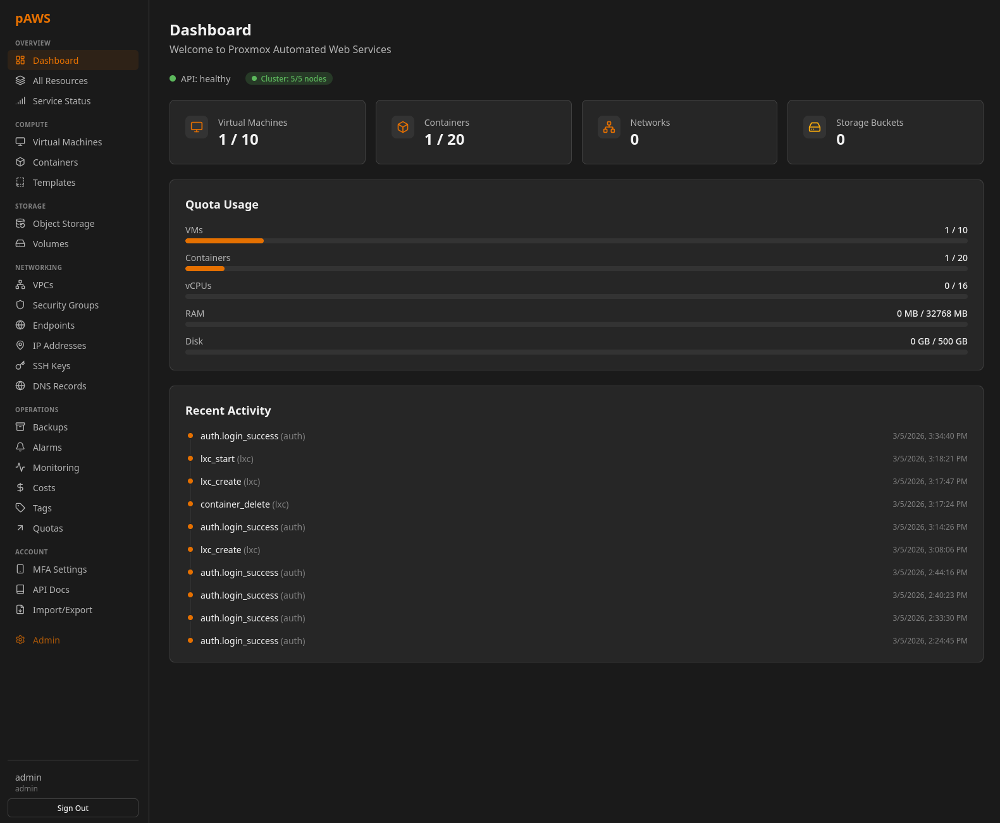
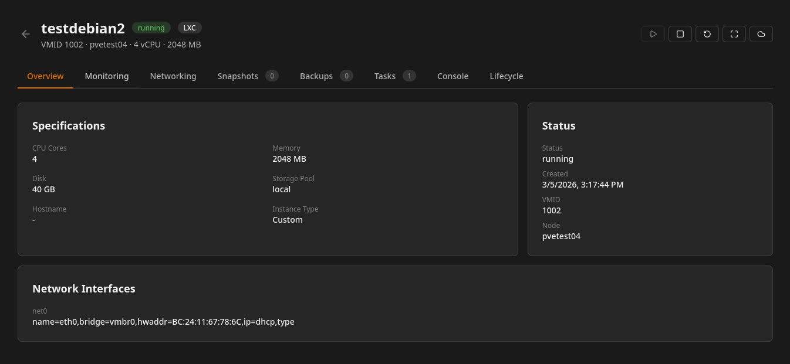
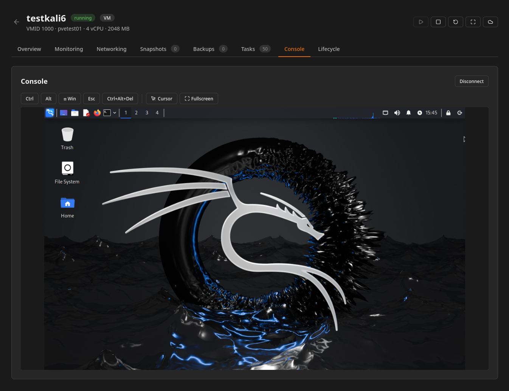
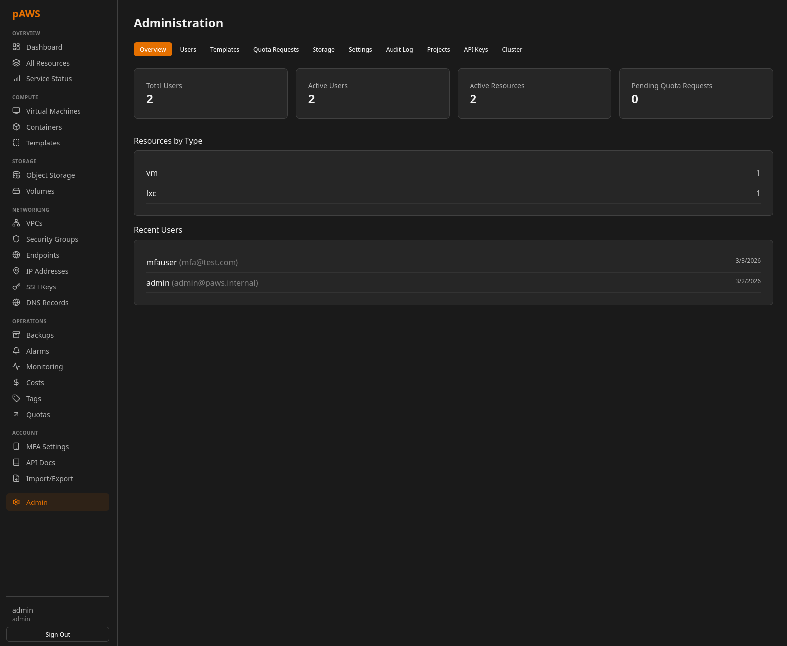

# pAWS - Proxmox Automated Web Services

[](https://github.com/coelacant1/Proxmox-Automated-Web-Services/actions/workflows/ci.yml)

A self-hosted, AWS-like infrastructure platform built on Proxmox VE. Provides multi-tenant compute, networking, storage, backups, monitoring, and billing through a web UI and REST API.

> [!WARNING]
> This is heavily work-in-progress and no where near usable. I am just working through building the user interface as well as working out features one-by-one as I link them to the UI.



## Targeted Features

- **Compute** - VMs and LXC containers from templates, full lifecycle, web console (noVNC/xterm.js), snapshots, import/export
- **Networking** - VPCs with subnets, security groups, service endpoints, DNS
- **Storage** - S3-compatible object storage (Ceph RadosGW) with file browser, sharing, presigned URLs
- **Backups** - PBS integration, scheduled plans, point-in-time restore
- **Monitoring** - Per-resource metrics, alarms, log aggregation
- **Billing** - Virtual credits, per-resource cost tracking, usage dashboards
- **Auth** - Local accounts (JWT) + OAuth2/OIDC, RBAC (Admin/Operator/Member/Viewer)
- **Admin** - User management, template catalog, quotas, audit logging

## Stack

| Layer | Technology |
|-------|-----------|
| Frontend | React 19, TypeScript, Vite, Tailwind CSS v4 |
| Backend | Python 3.12+, FastAPI, SQLAlchemy 2 (async), Pydantic v2 |
| Database | PostgreSQL 16 |
| Cache/Queue | Redis 7, Celery |
| Storage | Ceph RadosGW, Proxmox Backup Server |
| Hypervisor | Proxmox VE 8+ |

## Quick Start

```bash
# 1. Clone and configure
git clone https://github.com/coelacant1/Proxmox-Automated-Web-Services.git
cd Proxmox-Automated-Web-Services
cp .env.example .env    # edit with your Proxmox host, token, secret key

# 2. Start everything
docker compose up -d

# 3. Run migrations
docker compose exec backend alembic upgrade head

# 4. Get admin password (generated on first run)
docker compose logs backend | grep "admin account"
```

**Access:**
Web UI at `http://localhost:5173`
API docs at `http://localhost:8000/docs`, `http://localhost:8000/redoc`, and `http://localhost:8000/openapi.json`







## Local Development

```bash
# Data services
sudo docker compose up -d db redis

# Backend
cd backend
python -m venv .venv && source .venv/bin/activate
pip install -e ".[dev]"
export PAWS_SECRET_KEY=dev-secret-key
alembic upgrade head
uvicorn app.main:app --reload --port 8000

# Frontend (separate terminal)
cd frontend
npm install && npm run dev
```

## Testing

```bash
cd backend && pytest                # unit/integration tests (mocked deps, no external services)
cd frontend && npx tsc --noEmit     # type-check
./scripts/test.sh --all             # lint + tests + coverage + build
```

## Environment Variables

All use the `PAWS_` prefix. See `.env.example` for the full list. Key ones:

| Variable | Description |
|----------|-------------|
| `PAWS_SECRET_KEY` | JWT signing key (required) |
| `PAWS_PROXMOX_HOST` | Proxmox API hostname |
| `PAWS_PROXMOX_TOKEN_ID` | Proxmox API token ID |
| `PAWS_PROXMOX_TOKEN_SECRET` | Proxmox API token secret |
| `PAWS_DATABASE_URL` | PostgreSQL connection string |
| `PAWS_REDIS_URL` | Redis connection string |

## Contributing

See [CONTRIBUTING.md](CONTRIBUTING.md).

## License

See [LICENSE](LICENSE).
